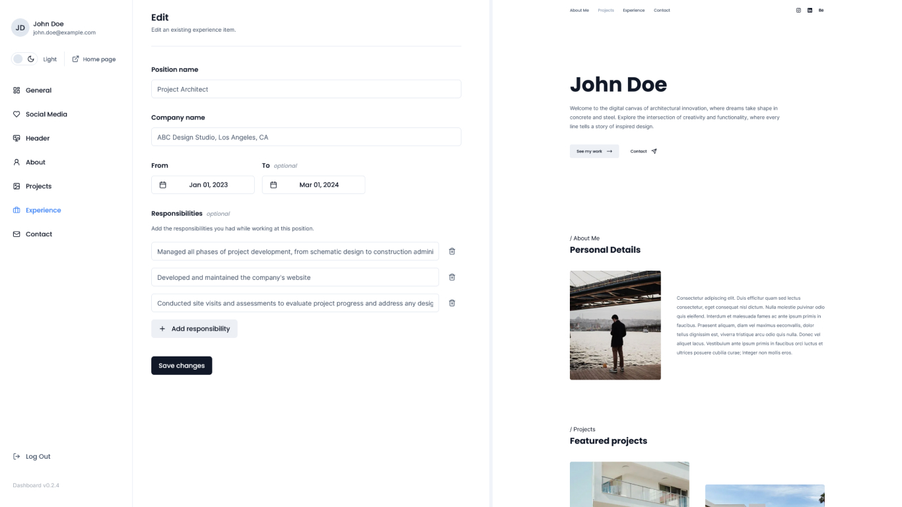

# T3 Portfolio

An open-source portfolio template with a custom admin dashboard bootstrapped with [`create-t3-app`](https://create.t3.gg/).

#### :warning: This project is in early development stage and is not recommended for production use. Various aspects of the application are subject to change.


_Dashboard and landing page view_

## Tech Stack

- [Next.js](https://nextjs.org) - Framework
- [NextAuth.js](https://next-auth.js.org) - Authentication
- [Prisma](https://prisma.io) - ORM
- [Tailwind CSS](https://tailwindcss.com) - Styling
- [shadcn/ui](https://ui.shadcn.com/) - UI components
- [tRPC](https://trpc.io) - Typesafe API
- [AWS S3](https://aws.amazon.com/s3/) - File uploading
- [Zod](https://zod.dev/) - API and forms validation
- [React Hook Form](https://www.react-hook-form.com/) - Managing forms
- [Framer motion](https://www.framer.com/motion/) - Animations

## Run the project

1. Clone the repository and install all dependencies using pnpm
2. Copy the `.env.example` to the `.env` file and update the variables
3. Push the prisma schema to the database `pnpm run prisma:push`
4. Start the development server `pnpm run dev`
5. If necessary, run prisma studio to check the db data `pnpm run prisma:studio`

## Environment variables

- Planetscale MySQL database URL. [PlanetScale Documentation](https://planetscale.com/docs/concepts/connection-strings)

```
DATABASE_URL=
```

- NextAuth.js authentication variables. [NextAuth Documentation](https://next-auth.js.org/configuration/options#environment-variables)

```
NEXTAUTH_SECRET=
NEXTAUTH_URL=
```

- Google provider keys required to login to the dashboard via Google account. [Google 0Auth Documentation](https://developers.google.com/identity/protocols/oauth2)

```
GOOGLE_CLIENT_ID =
GOOGLE_CLIENT_SECRET =
```

- AWS variables required to support uploading images to S3. [AWS S3 Documentation](https://docs.aws.amazon.com/AmazonS3/latest/userguide/GetStartedWithS3.html). More information on the AWS configuration will be available soon in an additional file.

```
AWS_S3_BUCKET=
AWS_S3_REGION=
AWS_S3_ACCESS_KEY=
AWS_S3_SECRET_ACCESS_KEY=
```

- Allowed email addresses with access to the dashboard (separated by commas)

```
ALLOWED_EMAIL_ADDRESSES=
```

## How do I deploy this?

Follow the deployment guides for [Vercel](https://create.t3.gg/en/deployment/vercel), [Netlify](https://create.t3.gg/en/deployment/netlify) and [Docker](https://create.t3.gg/en/deployment/docker) for more information.

## License

This project is under the MIT license
